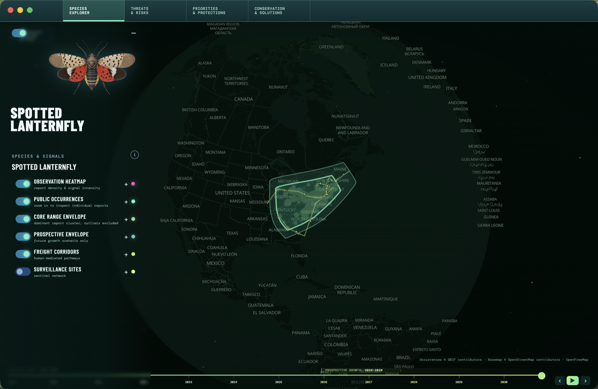

# LanternTrace Explorer

An Electron prototype inspired by the Blue Corridors species explorer, adapted to show a spotted lanternfly invasion-front workflow.



## Run

```bash
npm install
npm run data:gbif   # fetches the GBIF occurrence layer (not committed)
npm start
```

`npm run data:gbif` writes `generated/observations.js`, which is gitignored because it is a ~14 MB derived artifact. The app runs without it — the public-occurrence layer is simply empty until you generate it.

## What is included

- Map/globe view with a dark, presentation-oriented basemap.
- Inferred front, uncertainty band, real public-coordinate GBIF occurrence records, transport corridors, and surveillance-site layers.
- Time slider with play controls for the 2019–2025 front snapshots.
- Search for a small built-in set of places and regions.
- Evidence, action-priority, and methods/model-card panels.
- JSON export of the active front snapshot and visible layers.

## Data provenance

The occurrence layer is generated from the GBIF occurrence index with `npm run data:gbif`; its records are real public data and retain source identifiers.

The bundled front geometry in `data.js` remains an illustrative UI/data fixture, clearly labeled in the app. **It is not a field-validated invasion-front estimate.** Replace `data.js` with a locked front-estimation pipeline before using the inferred front for scientific or management claims.

Basemap © OpenStreetMap contributors via OpenFreeMap. Occurrences © GBIF contributors.

## Status

Prototype. Not packaged or released; `npm run pack` produces an unsigned local build only.
